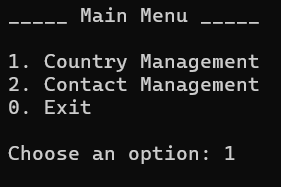
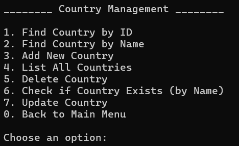
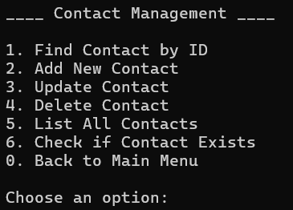

# Contact Management System

## Overview

Contact Management System is a console application that combines two core principles: implementing a Three-Layer Architecture and working directly with a database through ADO.NET, applied through complete management of both Countries and Contacts.

## Features

The project provides separate, complete management for both Countries and Contacts. Each entity supports the core operations: Add, Update, Delete, Find (by ID or by name), List All, and Check Existence — as shown in the main menu screenshots below.

## Screenshots

### Main Menu

### Country Management Menu

### Contact Management Menu

## Architecture

Each operation follows a clear call sequence across the three layers: the Presentation Layer calls the appropriate function in the Business Layer, which in turn calls the corresponding function in the Data Layer, where the actual execution against the database takes place.

## Tech Stack

- C#
- ADO.NET
- SQL Server

## Skills

Working on this project involved learning how to work within a three-layer project environment, and applying the most important types of SQL queries in a professional way — such as using existence-check queries instead of retrieving a full record just to determine whether an item exists, improving performance. DataTable features were also used to display and process query results (such as listing countries and contacts) in an organized and flexible way.